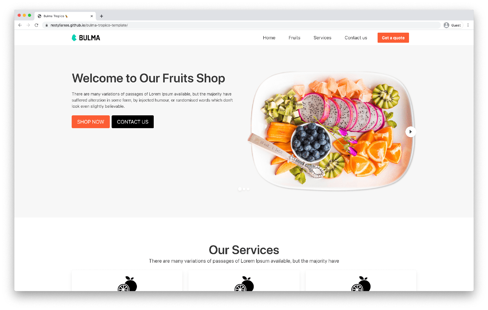

# Awesome Bulma Templates 

A list of real-world templates made using the Bulma CSS Framework

## Check out [Awesome-Bulma](https://github.com/aldi/awesome-bulma) 🎉
## Check out [Bulma-Social](https://github.com/aldi/bulma-social) 🎉

## Templates 🎨

Tropico Template: [Live Demo](https://restylianos.github.io/bulma-tropico-template/) | [Source Code](https://github.com/restylianos/bulma-tropico-template)

Wedding Planner Template: [Live Demo](https://restylianos.github.io/bulma-wedding-planner-template/) | [Source Code](https://github.com/restylianos/bulma-wedding-planner-template/)

Login Page Template: [Live Demo](https://aldi.github.io/bulma-login-template/) | [Source Code](https://github.com/aldi/bulma-login-template/)

CV Template: [Live Demo](https://aldi.github.io/bulma-cv-template/) | [Source Code](https://github.com/aldi/bulma-cv-template/)

Rent Template: [Live Demo](https://aldi.github.io/bulma-rent-template/) | [Source Code](https://github.com/aldi/bulma-rent-template/)

Hotel Template: [Live Demo](https://aldi.github.io/bulma-hotel-template/) | [Source Code](https://github.com/aldi/bulma-hotel-template/)

Event Participation Template: [Live Demo](https://aldi.github.io/bulma-event-participation-template/) | [Source Code](https://github.com/aldi/bulma-event-participation-template/)

Coming Soon Template: [Live Demo](https://aldi.github.io/bulma-coming-soon-template/) | [Source Code](https://github.com/aldi/bulma-coming-soon-template/)

Each template has its own dedicated repo. This repo is for showcase purposes only.

## Contributing 😍

Do you want to add your awesome template to the list?  
Follow the contribution guide [here](https://github.com/aldi/awesome-bulma-templates/blob/master/CONTRIBUTING.md).

## Licence 📜

Code released under [the MIT license](https://github.com/aldi/awesome-bulma-templates/blob/master/LICENSE).
